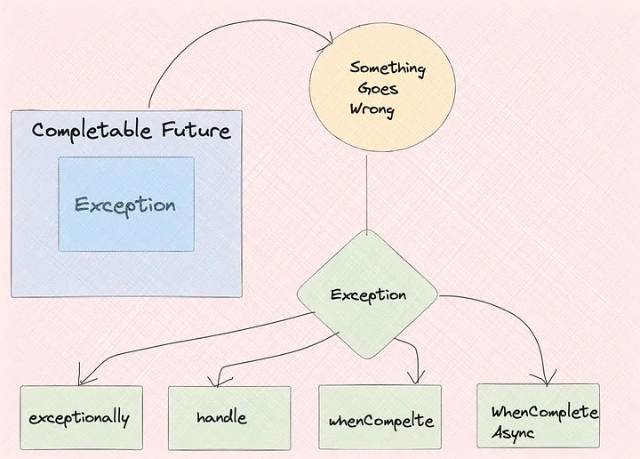

# Java Interview Questions & Answers

### Table of contents

| No | Questions|
| -- | -------- |
| 1 |[How to Manage exceptions with Completable Futures?](#How-to-Manage-exception-with-completable-futures?)|
| 2 |[Explain the difference between findAny and findFirst, and when would you prefer one over the other?](#explain-the-difference-between-findany-and-findfirst-and-when-would-you-prefer-one-over-the-other)|
| 3 | [When would you use Parallel Streams and why?](#when-would-you-use-parallel-streams-and-why)|
| 4 | [What if you have a list of Orders and each Order contains Edibles Fruits with quantities and prices. You want to find the total amount spent on each Fruit across all orders](#what-if-you-have-a-list-of-orders-and-each-order-contains-edibles-fruits-with-quantities-and-prices-you-want-to-find-the-total-amount-spent-on-each-fruit-across-all-orders)|
| 5 | [How do you stream a file?](#how-do-you-stream-a-file)|
| 6 | [What is the purpose of the peek method in a Stream?](#what-is-the-purpose-of-the-peek-method-in-a-stream)|
| 7 | [How do you convert a Stream to an array?](#how-do-you-convert-a-stream-to-an-array)|
| 8 | [How can you find the average salary for all the employees who have salary greater than 50000 in each department](#how-can-you-find-the-average-salary-for-all-the-employees-who-have-salary-greater-than-50000-in-each-department)|
| 9 | [How do you create threads in Java?](#how-do-you-create-threads-in-java)|
|10 | [How can you disable auto configuration in Spring Boot?](#how-can-you-disable-auto-configuration-in-spring-boot)|
|11 | [What is the difference between Patch and Post?](#what-is-the-difference-between-patch-and-post)|
|12 | [What are the difference scopes for Spring Beans?](#what-are-the-difference-scopes-for-spring-beans)|
|13 | [Describe and compare fail-fast and fail-safe iterators, Give examples](#describe-and-compare-fail-fast-and-fail-safe-iterators-give-examples)|
|14 | []()|
|15 | []()|
|16 | []()|


1. ### How to Manage exceptions with Completable Futures?
   

   There are several methods to handle exceptions with completable future.
   We can use methods like

   <em>exceptionally(Function<Throwable, T> fn)</em>

   <em>handle(BiFunction <? super T, Throwable, ? extends U>fn)</em>

   <em>whenCompelte</em>

   <em>whenCompleteAsync</em>
   
   These methods help in creating robust asynchronous systems by allowing you to specify error-handling behavior explicitly.
   
   **Below is an example of using exceptionally**

   ```java
      CompletableFuture<String> future = CompletableFuture.supplyAsync(() -> {
         if (Math.random() < 0.5) {
         throw new RuntimeException("Run Time Exception!");
         }
         return "Success";
      }).exceptionally(ex -> "Error: " + ex.getMessage());

      future.thenAccept(System.out::println);
   ```
   **Below is an example of using handle**

   ```java
      CompletableFuture<String> future = CompletableFuture.supplyAsync(() -> {
         if (Math.random() > 0.5) throw new RuntimeException("Error!");
            return "Hello";
         }).handle((result, ex) -> {
         if (ex != null) {
         return "Failed due to: " + ex.getMessage();
         }
         return result;
      });

      future.thenAccept(System.out::println);
   ```

   **Exception Handling using whenCompelte and whenCompleteAsync:**
   whenCompelte is executed in the same thread that completes the CompletableFuture or the caller thread if the future is already complete.

   whenCompelteAsync allows the completion handler to run in a different thread provided by the Executor or the default asynchronous execution facility.

   The choice between them depends on whether you need the non-blocking behavior and are willing to handle tasks in a separate thread

   **Below are the example of using whenCompelte and whenCompleteAsync**

   ```java
      CompletableFuture<String> future1 = CompletableFuture.supplyAsync(() -> {
         if (Math.random() > 0.5) throw new RuntimeException("Operation failed");
         return "Operation succeeded";
      }).whenComplete((result, ex) -> {
         if (ex != null) {
         System.out.println("Error: " + ex.getMessage());
         } else {
         System.out.println(result);
         }
      });
   ```

   ```java
      // Example of whenCompleteAsync
      CompletableFuture<String> future = CompletableFuture.supplyAsync(() -> {
         if (Math.random() > 0.5) throw new RuntimeException("Operation failed");
         return "Operation succeeded";
      }).whenCompleteAsync((result, ex) -> {
         if (ex != null) {
            System.out.println("Error: " + ex.getMessage());
         } else {
            System.out.println(result);
         }
      });
   ```

   **[⬆ Back to Top](#table-of-contents)**
   
2. ### Explain the difference between findAny and findFirst, and when would you prefer one over the other?
   
   **findFirst** returns the first element of the stream, respecting the encounter order if one exists.

   **findAny** can return any element from the stream, and it's more performance-friendly in parallel streams because it doesn't enforce processing order.

   **[⬆ Back to Top](#table-of-contents)**

3. ### When would you use Parallel Streams and why?

   We would use Parallel stream if
   - We have a lot of data to process in the same (or a very similar) way.
   - Ordering doesn’t matter.
   - Items are independent of each other.
   - if particular processing step is the bottleneck.
   
   Lets find the Sum of large list of integers.
   ```java
      package collectors;

      import java.util.ArrayList;
      import java.util.List;
      import java.util.Random;

      public class ParallelStreamsDemo {

        public static void main(String[] args) {
            // Create a large list of random integers
            List<Integer> numbers = new ArrayList<>();
            Random random = new Random();
            for (int i = 0; i < 1_000_000; i++) {
                numbers.add(random.nextInt(100));
            }

            // Calculate the sum using parallel stream
            long startTime = System.currentTimeMillis();
            int sum = numbers.parallelStream().reduce(0, Integer::sum);
            long endTime = System.currentTimeMillis();

            System.out.println("Sum: " + sum);
            System.out.println("Time taken with parallel stream: " + (endTime - startTime) + " ms");
        }
      }
   ```
   **[⬆ Back to Top](#table-of-contents)**

4. ### What if you have a list of Orders and each Order contains Edibles Fruits with quantities and prices. You want to find the total amount spent on each Fruit across all orders
   This requires some skills of grouping and summarizing.

   **Orders Model**
   ```java
      package collectors.model;

      import java.util.List;

      class Orders {
         List<Item> items;
         
      }
   ```
   **Item Model**
   ```java
      package collectors.model;

      public class Item {
         String name;
         double price;
      }
   ```
   **Results:**Below is the total price for each Fruit for all the orders.

   ```java
      package collectors;

      import collectors.model.Item;
      import collectors.model.Orders;

      import java.util.Arrays;
      import java.util.List;
      import java.util.Map;
      import java.util.stream.Collectors;

      public class ItemPriceAggregator {

         public static void main(String[] args) {

            List<Orders> orders = Arrays.asList(new Orders(Arrays.asList(new Item("Pears",200.45, 22),new Item("Mangoes",120.45, 45),new Item("Oranges",145.67, 22),new Item("Mandarins",207.45, 89))),
                     new Orders(Arrays.asList(new Item("Pears",200.45, 21),new Item("Mangoes",120.45, 459),new Item("Oranges",345.67, 22),new Item("Mandarins",207.45, 89))));

            Map<String, Double> totalAmountPerItem = orders.stream()
                     .flatMap(order -> order.items.stream())
                     .collect(Collectors.groupingBy(Item::getName,
                              Collectors.summingDouble(item -> item.price * item.quantity)));
            totalAmountPerItem.entrySet().stream()
                     .forEach(entry -> System.out.println(entry.getKey() + " = " + entry.getValue()));

         }
      }
   ```
   **[⬆ Back to Top](#table-of-contents)**
5. ### How do you stream a file?
   ```java
      Stream<String> lines = Files.lines(Paths.get("file.txt"));
   ```
   **[⬆ Back to Top](#table-of-contents)**

6. ### What is the purpose of the peek method in a Stream?
   peek is an intermediate operation used mainly for debugging purposes, as it allows you to perform an operation on each element of the stream as it's consumed.

   peek is used to

   >Observing Elements: is often used to observe the elements of the stream at a certain point in the pipeline.</m>

   This is particularly useful for debugging complex stream operations to understand how elements are transformed as they pass through various stages of the stream.

   >Logging: peek can be used to log information about the elements for debugging purposes without altering the stream's processing.
   Let’s say we have a list of integers, and we want to filter out numbers less than 10, map them to their squares, and then collect them into a list.

   While we are doing this we want to see the element after filtering and also after mapping. Lets look at the below example.
   ```java
      import java.util.Arrays;
      import java.util.List;
      import java.util.stream.Collectors;

      public class PeekExample {
         public static void main(String[] args) {
            List<Integer> numbers = Arrays.asList(1, 5, 10, 15, 20);

            List<Integer> squaredNumbers = numbers.stream()
                  .filter(n -> n >= 10)
                  .peek(n -> System.out.println("After filter: " + n))
                  .map(n -> n * n)
                  .peek(n -> System.out.println("After map: " + n))
                  .collect(Collectors.toList());
         }
      }
   ```
   In the above example we are peeking the elements to log them at each stage that could also be used for debugging purpose.

   **[⬆ Back to Top](#table-of-contents)**

7. ### How do you convert a Stream to an array?
   ```java
      String[] array = stream.toArray(String[]::new);
   ```

   **[⬆ Back to Top](#table-of-contents)**

8. ### How can you find the average salary for all the employees who have salary greater than 50000 in each department

   **Employee Model**
   ```java
      package collectors.model;

      import lombok.AllArgsConstructor;
      import lombok.Getter;
      import lombok.NoArgsConstructor;
      import lombok.Setter;

      import java.math.BigDecimal;
      @Getter
      @Setter
      @AllArgsConstructor
      @NoArgsConstructor
      public class Employee {
         private String name;
         private Department department;
         private BigDecimal salary;

      }
   ```

   **Department Model**
   ```java
      import lombok.AllArgsConstructor;
      import lombok.Getter;
      import lombok.NoArgsConstructor;
      import lombok.Setter;

      @Getter
      @Setter
      @AllArgsConstructor
      @NoArgsConstructor
      public class Department {
         private String name;

      }
   ```
   **Finding average salary in each department greater than 50000.**

   ```java
      package collectors.model;

      import java.math.BigDecimal;
      import java.util.Arrays;
      import java.util.List;
      import java.util.Map;
      import java.util.stream.Collectors;

      public class AverageSalaryByDept {
         public static void main(String[] args) {
            List<Employee> employees = Arrays.asList(new Employee("Vikas",new Department("IT"),new BigDecimal(212345.67)),
                     new Employee("Ravi",new Department("Commercial"),new BigDecimal(12345.67)),
                     new Employee("Rajni",new Department("Procurment"),new BigDecimal(322345.67)),
                     new Employee("Sinha",new Department("Commercial"),new BigDecimal(42345.67)));

            Map<Department, Double> averageSalaryByDepartment = employees.stream()
                     .filter(e -> e.getSalary().compareTo(new BigDecimal("50000")) > 0)
                     .collect(Collectors.groupingBy(Employee::getDepartment,
                              Collectors.mapping(Employee::getSalary,
                                    Collectors.averagingDouble(BigDecimal::doubleValue))));

            averageSalaryByDepartment.entrySet().stream()
                     .forEach(entry -> System.out.println(entry.getKey().getName() + " = " + entry.getValue()));
         }
      }
   ```

   **[⬆ Back to Top](#table-of-contents)**

9. ### How do you create threads in Java?
   we can create threads in many ways, I would disucss all the ways we can spawn threads directly or indirectly. All the below methods create threads in some or the other ways , there are som more direct ways of creating and using threads in Java and there are much more abstraction available in order to create threads to achieve concurrency like Executor framework and Completable Future.

   **By extending the thread class.**
   ```java   
      class NewThread extends Thread {
         public void run() {
            // Code to execute in the new thread
         }
      }
   

      // Creating and starting a thread
      MyThread t = new MyThread();
      t.start();
      Implementing the Runnable interface.
      class RannableThread implements Runnable {
         public void run() {
            // Code to execute in the new thread
         }
      }

      // Creating and starting a thread
      Thread t = new Thread(new MyRunnable());
      t.start();
      Using executor Framework.
      ExecutorService executor = Executors.newFixedThreadPool(10);
      executor.execute(new MyRunnable());
      executor.shutdown();
      Using callable and future.
      Callable<Integer> callableTask = () -> {
         // Task code, which returns a result
         return 42;
      };

      Future<Integer> future = executor.submit(callableTask);

      // Later, you can retrieve the result
      Integer result = future.get();
   ```
   **Using Parallel Streams:**
   Introduced in Java 8, parallel streams allow for parallel processing of collections in a functional style, abstracting away explicit thread management.

   ```java
      List<String> demoList = Arrays.asList("ABE", "BAC", "CSD", "DER", "ERT");
      myList.parallelStream()
            .filter(s -> s.startsWith("c"))
            .map(String::toUpperCase)
            .forEach(System.out::println);
      Fork/Join Framework:
      ForkJoinPool forkJoinPool = new ForkJoinPool(4); // Pool with 4 threads
      Long result = forkJoinPool.invoke(new MyRecursiveTask(data));
      Using Lambda Expression
      Thread thread = new Thread(() -> {
         for (int i = 1; i <= 5; i++) {
            System.out.println(i);
            try {
                  // Pausing for half a second
                  Thread.sleep(500);
            } catch (InterruptedException e) {
                  e.printStackTrace();
            }
         }
      });

      thread.start();
   ```   
   **Using Completable Future to run an async task**
   ```java
      import java.util.concurrent.CompletableFuture;
      import java.util.concurrent.ExecutorService;
      import java.util.concurrent.Executors;

      public class CompletableFutureExample {
         public static void main(String[] args) {
            // Using the common ForkJoinPool
            CompletableFuture<Void> future = CompletableFuture.runAsync(() -> {
                  // Task to run asynchronously
                  System.out.println("Running asynchronously in " + Thread.currentThread().getName());
            });

            // Wait for the CompletableFuture to complete
            future.join();
         }
      }
   ```
   **Supplying a Value and processing that Asynchronously.**
   >Supply a Task to run in another thread.

   >Process the results.

   >wait for all operations to complete before moving forward.
   ```java
      CompletableFuture<String> future = CompletableFuture.supplyAsync(() -> {
         // Simulate a long-running task
         try {
            Thread.sleep(500); // Sleep for 500 milliseconds
         } catch (InterruptedException e) {
            // Handle interruption
         }
         return "Result of the asynchronous computation";
      });

      // Process the result of the computation
      future.thenAccept(result -> System.out.println(result));

      future.join(); // Wait for all operations to complete
   ```
   **Using a custom Executor:**
   >Creating a Customer Executor

   >Running asynchronously differnt tasks in threads.

   >Joining all the task as a blocking operation.

   >Shutting down the executor.
   ```java
      ExecutorService executor = Executors.newCachedThreadPool();

      CompletableFuture<Void> future = CompletableFuture.runAsync(() -> {
         System.out.println("Running asynchronously in " + Thread.currentThread().getName());
      }, executor);

      future.join();
      executor.shutdown(); // Remember to shut down the executor
   ```
   **Virtual Threads As well**
   In order to create Virtual Threads Ensure you are using JDK 19 or later, as virtual threads are introduced in Java 19 as a preview feature.

   Since it’s a preview feature, you might need to enable preview features in your IDE and during compilation and execution by using the --enable-preview flag.

   ```java
      public class VirtualThread {
         public static void main(String[] args) {
            Thread virtualThread = Thread.ofVirtual().start(() -> {
                  System.out.println("Running in a virtual thread: " + Thread.currentThread().getName());
            });

            // Wait for the virtual thread to complete its execution
            virtualThread.join();
         }
      }
   ```
   Now when some one ask you how many ways you can create threads in Java so you have at least above methods available to talk about. Threads are everywhere and are very prevalent in programming and efficient usage of threads is very helpful in order to create memory efficient and CPU efficient programs. I hope you would like this quick reference and you will be able to use this further. Thanks a lot for sharing and clapping. Your support means a lot to me.

   **[⬆ Back to Top](#table-of-contents)**

10. ### How can you disable auto configuration in Spring Boot?
      >Exclude Auto-Configuration Classes

      You can use the exclude attribute of the @SpringBootApplication

      ```java
         import org.springframework.boot.autoconfigure.*;
         import org.springframework.boot.SpringApplication;
         import org.springframework.context.annotation.Configuration;

         @SpringBootApplication(exclude = {DataSourceAutoConfiguration.class})
         public class MyApplication {
            public static void main(String[] args) {
               SpringApplication.run(MyApplication.class, args);
            }
         }
      ```

      Using the excludeName Attribute

      ```java

         @SpringBootApplication(excludeName = {"org.springframework.boot.autoconfigure.jdbc.DataSourceAutoConfiguration"})
         public class MyApplication {
            public static void main(String[] args) {
               SpringApplication.run(MyApplication.class, args);
            }
         }
      ```
      Using spring.autoconfigure.exclude Property

      we can use spring.autoconfigure.exclude property in your application.properties or application.yml file. If you want to confine the exclusion to the code , this is a good method.

      spring.autoconfigure.exclude=org.springframework.boot.autoconfigure.jdbc.DataSourceAutoConfiguration
      Using @EnableAutoConfiguration with Exclude
      ```java
         import org.springframework.boot.autoconfigure.EnableAutoConfiguration;
         import org.springframework.context.annotation.Configuration;

         @Configuration
         @EnableAutoConfiguration(exclude = {DataSourceAutoConfiguration.class})
         public class MyApplicationConfig {
            
         }
      ```
   **[⬆ Back to Top](#table-of-contents)**

11. ### What is the difference between Patch and Post?
      **POST**
      >Purpose: POST is commonly used to create a new resource.

      >Idempotency: POST requests are not idempotent, which means that making multiple identical POST requests could have different effects, such as creating multiple resources.

      **Usage:**

      Creating Resources: POST is often used to create a new resource within a collection. For example, POST /users might create a new user.
      Submitting Data: It can be used for submitting form data or uploading a file.
      Other Operations: Sometimes used for operations that don’t fit into the standard CRUD (Create, Read, Update, Delete) operations, such as performing an action (e.g., POST /orders/123/cancel).

      **PATCH**
      >The PATCH method is used for partial updates to a resource.

      >It applies a partial update to the resource's state, meaning that only the specified changes are applied, and the rest of the resource remains unchanged.

      1. Idempotency: PATCH can be idempotent, but it isn't strictly required to be. An idempotent PATCH request means that applying the same PATCH request multiple times will not have further effects after the initial application.
      
      **Usage:**

      patch can be used for Partial Updates: PATCH is used when you need to update just a part of a resource's data. For example, if you have a user resource and you want to update just the user's email, you would use PATCH /users/123 with a payload that specifies the new email value.
      In order to minimize the network bandwidth, It’s beneficial when you want to minimize the amount of data sent between the client and the server. Instead of sending the full resource, only the changes are sent.

   **[⬆ Back to Top](#table-of-contents)**

12. ### What are the difference scopes for Spring Beans?
       1. **Singleton (Default)**
       Singleton scope ensures that there is only one instance of the bean in the Spring container. Once it is defined the same instance is being returned.
       Use Case: Most common for stateless beans where the same instance can be shared.
       ```java
       import org.springframework.context.annotation.Bean;
       import org.springframework.context.annotation.Configuration;

       @Configuration
       public class ApplicationConfiguration {

          @Bean // Singleton scope is the default
          public MySingletonBean mySingletonBean() {
             return new MySingletonBean();
          }

          static class MySingletonBean {
             // Bean implementation
          }
       }
       ```
       2. **Prototype**
       Prototype scope creates a new instance each time a bean is requested from the container.
       It is the opposite of singleton scope, providing a unique instance to each request for a bean.

       Use Case: Useful for stateful beans where each consumer requires a new instance.
       ```java
       import org.springframework.context.annotation.Bean;
       import org.springframework.context.annotation.Configuration;
       import org.springframework.context.annotation.Scope;

       @Configuration
       public class ApplicationConfiguration {

          @Bean
          @Scope("prototype")
          public MyPrototypeBean myPrototypeBean() {
             return new MyPrototypeBean();
          }

          static class MyPrototypeBean {
             // Bean implementation
          }
       }
       ```
       3. **Request**
       Request scope creates a bean instance for a single HTTP request; a new instance is created for each HTTP request.

       Use Case: Suitable for web applications where you need to maintain bean state within a single HTTP request.
       ```java
       import org.springframework.context.annotation.Bean;
       import org.springframework.context.annotation.Configuration;
       import org.springframework.web.context.annotation.RequestScope;

       @Configuration
       public class WebAppConfig {

          @Bean
          @RequestScope
          public MyRequestBean myRequestBean() {
             return new MyRequestBean();
          }

          static class MyRequestBean {
             // Bean implementation
          }
       }
       ```
        4. **Session**
        Session scope creates a bean instance for an HTTP session; a new instance is created for each HTTP session.

        Use Case: Ideal for keeping user-specific data that needs to persist across multiple HTTP requests within the same session.
        ```java
        import org.springframework.context.annotation.Bean;
        import org.springframework.context.annotation.Configuration;
        import org.springframework.web.context.annotation.SessionScope;

        @Configuration
        public class WebAppConfig {

            @Bean
            @SessionScope
            public MySessionBean mySessionBean() {
                return new MySessionBean();
            }

            static class MySessionBean {
                // Bean implementation
            }
        }
        ```
        5. **Application**
        Application scope creates a bean instance for the lifecycle of a ServletContext.
        it’s similar to singleton scope but scoped to a web application’s lifecycle.

        Use Case: Useful for shared application state objects, such as configuration data.
        ```java
        import org.springframework.context.annotation.Bean;
        import org.springframework.context.annotation.Configuration;
        import org.springframework.web.context.annotation.ApplicationScope;

        @Configuration
        public class WebAppConfig {

            @Bean
            @ApplicationScope
            public MyApplicationBean myApplicationBean() {
                return new MyApplicationBean();
            }

            static class MyApplicationBean {
                // Bean implementation
            }
        }
        ```
        6. **WebSocket**
        Scope: WebSocket scope creates a bean instance for the lifecycle of a WebSocket session; a new instance is created for each WebSocket session.
        Use Case: Applicable for managing data within the scope of a WebSocket interaction.
        ```java
        import org.springframework.context.annotation.Bean;
        import org.springframework.context.annotation.Configuration;
        import org.springframework.web.socket.config.annotation.EnableWebSocket;
        import org.springframework.web.socket.config.annotation.WebSocketConfigurer;
        import org.springframework.web.socket.config.annotation.WebSocketHandlerRegistry;
        import org.springframework.web.context.annotation.WebSocketScope;

        @Configuration
        @EnableWebSocket
        public class WebSocketConfig implements WebSocketConfigurer {

            @Override
            public void registerWebSocketHandlers(WebSocketHandlerRegistry registry) {
                registry.addHandler(myHandler(), "/myHandler").setAllowedOrigins("*");
            }

            @Bean
            @WebSocketScope
            public MyWebSocketBean myHandler() {
                return new MyWebSocketBean();
            }

            static class MyWebSocketBean {
                // Bean implementation, can also implement WebSocketHandler interface
            }
        }
        ```
        Differences and Considerations:
          - Singleton and application scopes share a long-lived nature, tied to the application lifecycle, while
          - Prototype, request, session, and WebSocket scopes define shorter-lived, more dynamic instances.
          - Singleton and application scoped beans are ideal for stateless behavior or shared state, whereas
          - Prototype, request, session, and WebSocket scopes are suitable for managing stateful interactions.
          - Prototype scope can lead to higher memory consumption and resource use due to the creation of a new instance per request.
          - Singleton scope is resource efficient.
          - Request, session, application, and WebSocket scopes are web-aware, meaning they are meant to be used in Web Context.

   **[⬆ Back to Top](#table-of-contents)**

13. ### Describe and compare fail-fast and fail-safe iterators, Give examples
      The main distinctions between fail-fast and fail-safe iterators is whether or not the collection can be modified while it is being iterated. Fail-safe iterator allows this; fail-fast iterator does not

      **fail-fast** Iterators operate directly on the collections itself. During iterations, fail-fasat iterators fail as soon as they realize that the collection is being modified (added, modified, remove) and will throw an concurrentModificationException. Some examples include ArrayList, HashSet and HashMap

      **fail-safe** iterators operate on cloned copy of the collection and therefore do not throw an exception is modified during iteration. Examples would include iterators returned by ConcurrentHashMap or CopyOnWriteArrayList


